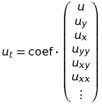

# pde-net-in-tf
My implementation of PDE-Net in Tensorflow

It suffices to run main.py and compare the results to the generated data

The output contains the learned coefficients (the ones corresponding to the lowest order derivatives first) and moment-matrices.
In the linear case, this is as follows:

As for examples, simply change the fifth line in inferring_the_pde.py to one of the following:
- import cfd_python.advection_diffusion.generate_data as gD
- import cfd_python.diffusion.generate_data as gD
- import cfd_python.linear_convection.generate_data as gD

Note that the FD-generation of data is not stable for most parameters.
